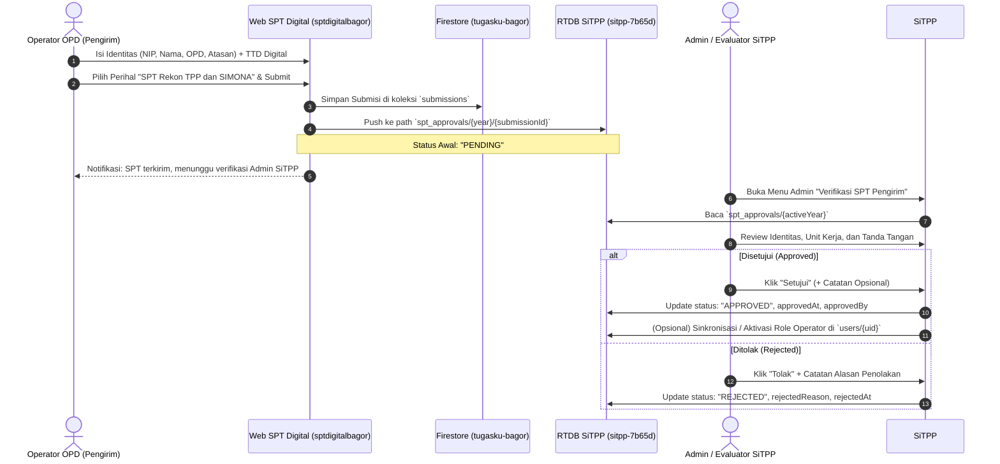

# Spesifikasi Desain: Integrasi SPT Digital ke SiTPP & Antrean Approval Operator

**Tanggal**: 2026-10-05  
**Domain**: Integrasi Lintas Aplikasi (`sptdigitalbagor` -> `SiTPP`)  
**Target Sistem**:
- **Source**: Aplikasi Kirim SPT Digital (`sptdigitalbagor`, Firebase `tugasku-bagor`)
- **Destination**: Aplikasi SiTPP (`Proyek SiTPP`, Firebase RTDB `sitpp-7b65d`)

---

## 1. Latar Belakang & Kebutuhan

Aplikasi **Kirim SPT Digital** digunakan oleh perwakilan operator/admin dari setiap OPD untuk menyerahkan Surat Perintah Tugas (SPT) resmi yang telah ditandatangani oleh atasan (Kepala OPD/Sekretaris/Camat).

Kebutuhan bisnis:
1. Setiap admin/operator pengirim yang mengirimkan SPT dengan perihal integrasi **SITPP** (misal: "SPT Rekon TPP dan SIMONA") datanya harus diteruskan dan masuk ke dalam sistem **SiTPP**.
2. Di dalam sistem SiTPP, data operator pengirim tidak langsung aktif atau langsung menjadi akun mandiri, melainkan masuk ke dalam **Antrean Approval (Daftar Verifikasi SPT)** terlebih dahulu.
3. Tim Admin/Evaluator SiTPP memeriksa data admin, kesesuaian OPD, nama atasan, serta dokumen/tanda tangan digital SPT.
4. Setelah diverifikasi dan **Disetujui (Approved)** oleh Admin SiTPP, akun/hak akses operator di SiTPP diaktifkan atau status verifikasi OPD dinyatakan sah untuk penyusunan TPP. Jika **Ditolak (Rejected)**, dicantumkan catatan perbaikan.

---

## 2. Arsitektur Komunikasi & Alur Data



---

## 3. Skema Data SiTPP Realtime Database (`spt_approvals`)

Data disimpan pada path:
`spt_approvals/{year}/{submissionId}`

```json
{
  "id": "SUBM_2026_001",
  "waktu": "2026-10-05 08:30:00",
  "tahun": 2026,
  "perihal": "SPT Rekon TPP dan SIMONA",
  "opdId": "dinas_pendidikan",
  "unitKerja": "Dinas Pendidikan dan Kebudayaan",
  "namaAdmin": "Ahmad Fauzi, S.Kom",
  "nipAdmin": "198801012010011002",
  "email": "ahmad.fauzi@muarojambikab.go.id",
  "namaAtasan": "Drs. H. M. Nasir, M.Si",
  "jabatanAtasan": "Kepala Dinas",
  "pangkatGolAtasan": "Pembina Utama Muda (IV/c)",
  "nipAtasan": "196805121993031005",
  "ttd": "data:image/png;base64,iVBORw0KGgoAAAANS...",
  "statusApproval": "PENDING",
  "approvalHistory": {
    "submittedAt": 1791163800000,
    "reviewedAt": null,
    "reviewedBy": null,
    "reviewNotes": ""
  },
  "source": "sptdigitalbagor"
}
```

### Nilai Status Approval:
1. `PENDING` (🟡 Menunggu Verifikasi): Data baru masuk dari formulir SPT Digital.
2. `APPROVED` (🟢 Disetujui): Dokumen sah, operator berhak mengelola data TPP OPD.
3. `REJECTED` (🔴 Ditolak / Perlu Perbaikan): Berkas tidak sesuai, operator diminta submit ulang.

---

## 4. UI/UX di Workspace SiTPP

1. **Menu Navigasi Admin**:
   * Menambahkan menu di Sidebar / Header Admin SiTPP: **"Verifikasi SPT Operator"** dengan lencana (badge) counter yang menampilkan jumlah submisi yang masih `PENDING`.
2. **Halaman Verifikasi (`js-admin-spt-approval.html`)**:
   * **Filter Cepat**: Semua, Menunggu Persetujuan, Disetujui, Ditolak.
   * **Pencarian Autocomplete OPD**: Memanfaatkan sistem hierarki OPD Induk & Unit Kerja yang sudah ada di SiTPP.
   * **Tabel / Kartu Submisi**:
     - Tanggal & Jam Kirim
     - Unit Kerja / OPD
     - Operator (Nama, NIP, Kontak)
     - Atasan Penandatangan
     - Status Badge
     - Tombol Aksi: **Detail & Dokumen**, **Setujui**, **Tolak**.
   * **Modal Pratinjau SPT**: Menampilkan rincian form, surat tugas, serta visualisasi tanda tangan digital atasan.

---

## 5. Security Rules di SiTPP (`database.rules.json`)

```json
"spt_approvals": {
  "$year": {
    ".read": "auth != null",
    ".write": "auth != null && (root.child('users').child(auth.uid).child('role').val() === 'admin' || root.child('users').child(auth.uid).child('role').val() === 'evaluator')",
    "$submissionId": {
      ".write": "true" // Memungkinkan pengiriman dari formulir publik SPT Digital (dibatasi validasi struktur)
    }
  }
}
```
*(Atau menggunakan REST API Firebase Database secret/token dari backend adapter SPT Digital).*
